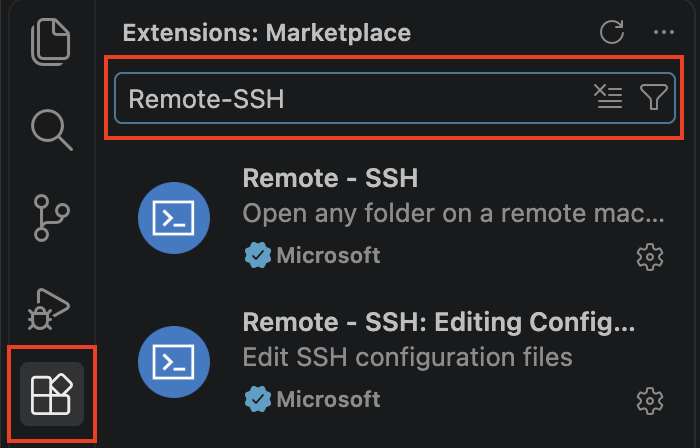
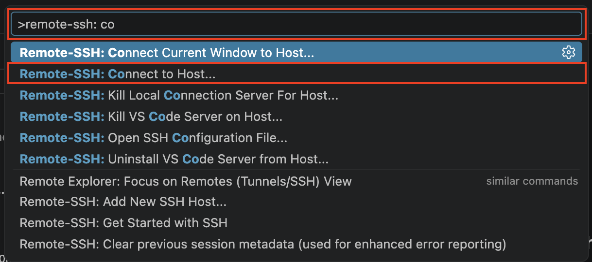
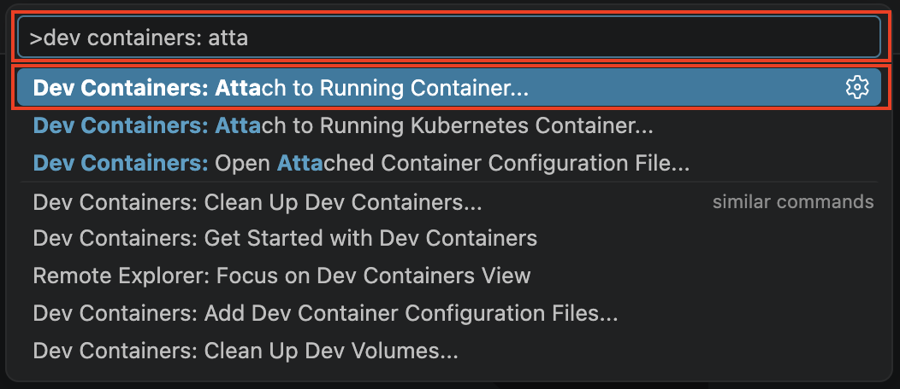

# Setup VSCode to Edit Files in the ROS2 Docker Container    
<p align="right">
  <em>Prepared by Qingqing Ni</em>
</p>

!!! info   
    This allows you to edit files inside the `ros2_humble` Docker container directly from the Ubuntu VM.

## 1. Install VS Code

Download the `.deb` installer from [VScode download page](https://code.visualstudio.com/Download).

Choose the correct architecture:

- **ARM64** for an ARM-based Ubuntu VM running on macOS (Apple Silicon)
- **x64** for an Intel/AMD Ubuntu VM running on Windows and macOS (Intel processors)

Install it with:

```bash
cd ~/Downloads
sudo apt install ./code_*.deb
```
!!! tip
    You can drag and drop the `.deb` file onto the terminal instead to have its path automatically filled in.

Launch VS Code:

```bash
code
```

## 2. Install the Required Extensions

In VS Code, install the following extensions:

- **Remote - SSH**
- **Dev Containers**

{width="300"}

## 3. Configure SSH

!!! info
    If you've already set up the SSH shortcut, you should have `~/.ssh/config` set up, you can skip this step.

Make sure `~/.ssh/config` contains:

```ssh-config
Host <nickname>
    HostName balanceX.local
    User balance
```

For example, if you are using the default nickname `car`, on car number 2, the entry would be:

```ssh-config
Host car
    HostName balance2.local
    User balance
```

Test the connection:

```bash
ssh car
```

!!! warning
    Do not use `car-ros` for VS Code Remote SSH if it contains a `RemoteCommand`. Use `car` instead.

## 4. Connect VS Code to the Raspberry Pi

Launch VS Code and press:

```text
Ctrl + Shift + P (for Windows)
Cmd + Shift + P (for macOS)
```

Select:

```text
Remote-SSH: Connect to Host...
```

!!! tip
    You can type in `Remote-SSH: ...` to find the option.

{width="500"}

Then select:

```text
car
```

VS Code will automatically install its remote server on the Raspberry Pi. This might take a while. 

Once connected, the bottom-left corner of VS Code should show:

```text
SSH: car
```

## 5. Start the ROS 2 Container

Make sure the ROS 2 container is running, or you can open a terminal in VS Code and run:

```bash
ros2-start
```

## 6. Attach VS Code to the Container

Press:

```text
Ctrl + Shift + P (for Windows)
Cmd + Shift + P (for macOS)
```

Select:

```text
Dev Containers: Attach to Running Container...
```
{width="500"}

Then select:

```text
ros2_humble
```

VS Code will automatically install its remote server inside the container. This might take a while. 

Once connected, the bottom-left corner of VS Code should show:

```text
Dev Container: ros2_humble
```

## 7. Open the ROS 2 Workspace

Go to:

```text
File → Open Folder...
```

Open:

```text
/home/ros2_ws
```

You can now directly view, edit, and save files inside the Raspberry Pi's ROS 2 container.

For example:

```text
/home/ros2_ws/src/<package>/<file>.py
```

Changes are saved directly inside the container.

## 8. Troubleshooting

### 8.1 VS Code Fails to Launch on VM

If VS Code fails to launch, open a terminal window on your VM and run:

```bash
code --verbose
```
From the log, if you see:

```text
No space left on device
```

check the available storage:

```bash
df -h
```

If the available storage is low, you can try deleting some files or increasing the storage size.

To safely clear the cache and system logs, run:

```bash
sudo apt-get clean
sudo journalctl --vacuum-size=50M
```

Other possible solutions include:

- **Increase the storage size of the VM from VMWare**
- **Delete unused files**
- **Clear Trash**


### 8.2 Failed to Install VS Code Server

If VS Code reports unable to install the server on the Raspberry Pi or the Docker container:

```text
Could not establish connection to <server_name>: failed to install the VS Code Server.
```

Check the available storage on the Raspberry Pi and the Docker container. The same command from 8.2 works for both.
